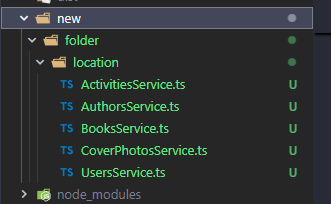

# Playwright Service Generator

Generate **Playwright API service classes** from your OpenAPI specification.  
This package converts your API endpoints into clean, camelCase methods.

## 🚀 Features

- 🛠 Generates Playwright service classes directly from an OpenAPI spec  
- 🐫 Creates clean camelCase method names (`getUsersById`, `postOrders`)  
- 🧩 Automatically generates **custom Playwright fixtures** for each service, so you can inject them directly into your tests  
- ⚡ Works seamlessly with Playwright’s built-in `request` fixture 

## 📦 Installation

```bash
npm install @jtgober/playwright-service-generator
```
## 📖 Usage
1. Generate services from your OpenAPI spec

```bash
npx generate-services  --swaggerUrl YOUR-SWAGGER-JSON
# or alias
npx generate-services  --s YOUR-SWAGGER-JSON
```

2. Example generated service

Given this swagger.json: 

```http
https://fakerestapi.azurewebsites.net/swagger/v1/swagger.json
```

You’ll get a services like:

```ts
//services/ActivitiesService.ts
import { APIRequestContext } from '@playwright/test';

export class ActivitiesService {

  async getActivities(request: APIRequestContext, ) {
    const res = request.get(`/api/v1/Activities`);
    return res;
  }

  async postActivities(request: APIRequestContext, data?: any) {
    const res = request.post(`/api/v1/Activities`, { data });
    return res;
  }

  async getActivitiesById(request: APIRequestContext, id) {
    const res = request.get(`/api/v1/Activities/${id}`);
    return res;
  }

  async putActivitiesById(request: APIRequestContext, id, data?: any) {
    const res = request.put(`/api/v1/Activities/${id}`, { data });
    return res;
  }

  async deleteActivitiesById(request: APIRequestContext, id) {
    const res = request.delete(`/api/v1/Activities/${id}`);
    return res;
  }
}
```

3. They are also added as custom fixtures - creating a `base.ts` class

```ts
//base.ts
import { test as base } from '@playwright/test';
import { ActivitiesService } from '../services/ActivitiesService.js';
import { AuthorsService } from '../services/AuthorsService.js';
 //... all other imports

type MyFixtures = {
  activitiesService: ActivitiesService;
  authorsService: AuthorsService;
 //... all other typed fixtures
};

export const test = base.extend<MyFixtures>({
  activitiesService: async ({ }, use) => {
    const service = new ActivitiesService();
    await use(service);
  },
  authorsService: async ({ }, use) => {
    const service = new AuthorsService();
    await use(service);
  },
  //... all other services
});

export { expect } from '@playwright/test';
```

4. Tests can now use any fixture

```ts
//my-test.spec.ts
import { test, expect } from './base';

test('Sample test to verify setup', async ({ request, usersService }) => {
    const response = await usersService.getUsers(request);
    expect(response.status()).toBe(200);
});

```

## Additional Option: output-dir

You can specify where you want your services to go by using
```bash
--output-dir MY-SERVICES-FOLDER
## or alias
--o MY-SERVICES-FOLDER
```

Example:
```bash
npx generate-services  --s https://fakerestapi.azurewebsites.net/swagger/v1/swagger.json --o new/folder/location
```

